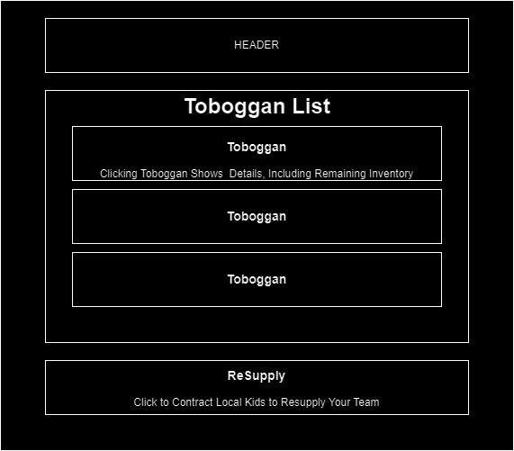

# _Snowball Ammunition Tracker_

#### By **Aaron Brown**

#### A web site for tracking Snowball Ammunition Supplies.

## Technologies Used

* React
* javascript
* node

## Description
This utility allows for tracking snowball inventory levels purchased on toboggans from local kids.

## Setup Requirements

* Clone the repository **git clone https://github.com/aaronvbrown/snowball-ammunition-tracker.git**  in the terminal

* navigate to the production directory
* `npm install`
* `npm run start` runs the app.
Open [http://localhost:3000](http://localhost:3000) to view it in your browser.\
The page will reload when you make changes.\
You may also see any lint errors in the console.
* `npm run build` builds the app for production to the `build` folder.\
It correctly bundles React in production mode and optimizes the build for the best performance.\
The build is minified and the filenames include the hashes.\
Your app is ready to be deployed!

## Known Bugs
* Missing Inventory Levels
* Missing Consumption
* Please report any bugs at the [github repo issues page](https://github.com/aaronvbrown/snowball-ammunition-tracker/issues)

## Attributions
  

## License
MIT License